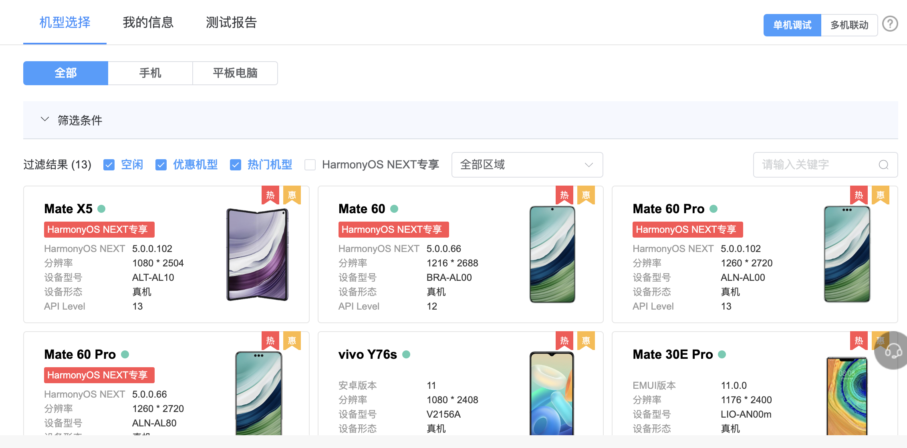

# Harmony TodoList demo

> 本文将通过使用ArkTS、uni-app、Taro三种框架，分别写todolist小demo，进行对比。

## 1. 前置条件

1. 需要进行华为开发者实名认证
2. [`ArkTS`](https://developer.huawei.com/consumer/cn/doc/harmonyos-guides-V5/arkts-get-started-V5)
3. [`uniapp + Vue3`](https://uniapp.dcloud.net.cn/tutorial/harmony/intro.html)
4. [`Taro + React`](https://taro-docs.jd.com/docs/harmony)

## 2. 使用ArkTS

> 下载好`DevEco Studio`，[跟着鸿蒙文档快速上手hello world](https://developer.huawei.com/consumer/cn/doc/harmonyos-guides-V5/start-with-ets-stage-V5)

### 2.1 添加Todolist页面

新建文件 `entry > src > main > ets > pages > Todolist.ets`


### 2.2 添加todolist路由

`entry > src > main > resources > base > profile > main_pages.json`

```json
{
  "src": [
    "pages/Index",
    "pages/Todolist"
  ]
}
```

### 2.3 首页增加跳转按钮

`entry > src > main > ets > pages > Index.ets`

```typescript
import { router } from "@kit.ArkUI";
import { BusinessError } from '@kit.BasicServicesKit';

Button() {
 Text('goto todolist')
  .fontSize(30)
  .fontWeight(FontWeight.Normal)
  .fontColor('white')
}
  .type(ButtonType.Capsule)
  .backgroundColor("#0D9FFB")
  .width('auto')
  .height('auto')
  .padding('10 5')
  .onClick(() => {
    try {
      router.pushUrl({
        url: "pages/Todolist"
      });
    }catch(e) {
      const errMsg = (e as BusinessError).message;
      console.error(errMsg);
    }
  })
```

### 2.4 完成Todolist页面

> [布局文档](https://developer.huawei.com/consumer/cn/doc/harmonyos-guides-V5/arkts-layout-development-linear-V5)，有web开发人员熟悉的Flex、Row、Column等布局方式，直接干


1. 首先完成顶部输入框+提交按钮

```typescript
export interface ICurEditObj {
    val: string;
    index: number;
}

@Entry
@Component
struct Todolist {
  @State inputVal: string = ''; // 输入框内容
  @State private list: string[] = []; // 列表
  @State curEditObj: ICurEditObj = { val: "", index: 0 }; // 当前修改项
  scroller:Scroller = new Scroller();
  
  build() {
    Flex({direction: FlexDirection.Column}) {
      // 顶部输入
      Row({space: 10}) {
        TextInput({text: this.inputVal, placeholder: '请输入...'})
          .placeholderFont({ size: 14, weight: 400 })
          .placeholderColor(Color.Gray)
          .width('76%')
          .height('100%')
          .fontSize(14)
          .fontColor('#333333')
          .type(InputType.Normal)
          .onChange((val: string) => {
            this.inputVal = val;
          })

        Button() {
          Text('提交')
            .fontSize(18)
            .fontWeight(FontWeight.Normal)
            .fontColor('white')
        }
          .type(ButtonType.Capsule)
          .width('24%')
          .height('100%')
          .flexShrink(1)
          .backgroundColor('#06BA8C')
          .onClick(():void => {
            console.log('click:', this.inputVal);
            
            if(this.inputVal === "" || this.inputVal.trim() === "") {
              // 这里暂时没找到Toast的方法，先用AlertDialog代替
              AlertDialog.show({
                title: "",
                message: "内容不可为空",
                isModal: true,
                autoCancel: true,
                alignment: DialogAlignment.Center,
                borderWidth: 0,
                cornerRadius: 10,
                width: '50%',
                gridCount: 1
              });
              return;
            }

            this.list.unshift(this.inputVal);
            this.inputVal = "";
          });
      }.width('100%').height(40);

      // 中间列表滚动区域
      Scroll(this.scroller) {
        // list item
      }
        .backgroundColor('white')
        .scrollable(ScrollDirection.Vertical) // 滚动方向为垂直方向
          // .scrollBar(BarState.On) // 滚动条常驻显示
        .scrollBarColor(Color.Gray) // 滚动条颜色
        .scrollBarWidth(5) // 滚动条宽度
        .edgeEffect(EdgeEffect.Spring) // 滚动到边沿后回弹
        .height('auto')
        .margin({top: 20})
        .padding(10)
        .borderRadius(4)
    }
      .height('100%')
      .width('100%')
      .backgroundColor('#f6f6f6')
      .padding(10)
  }
}
```

2. 接着完成中间列表滚动部分

    + [if/else条件渲染](https://developer.huawei.com/consumer/cn/doc/harmonyos-guides-V5/arkts-rendering-control-ifelse-V5)
    + [ForEach循环渲染](https://developer.huawei.com/consumer/cn/doc/harmonyos-guides-V5/arkts-rendering-control-foreach-V5)
  
```typescript
Scroll(this.scroller) {
  Column({space:10}) {
    if(this.list.length > 0) {
      ForEach(this.list, (item?:string, index?:number) => {
        if(item && typeof index === 'number') {
          Row({space: 10}) {
            Text(`${index+1}. ${item}`)
              .fontSize(14)
              .fontColor('#333333')
              .width('58%')
              .wordBreak(WordBreak.BREAK_ALL)
              .maxLines(2)
              .textOverflow({ overflow: TextOverflow.MARQUEE })

            Row({space: 5}) {
              Button() {
                Text('编辑').fontSize(14).fontColor(Color.White)
              }
              .width('50%')
                .height('100%')
                .flexShrink(0)
                .flexGrow(0)
                .flexBasis('50%')
                .backgroundColor(Color.Blue)
                .onClick(() => {
                  // 打开自定义模态框
                  console.log("当前数据：", item);
                })

              Button() {
                Text('删除').fontSize(14).fontColor(Color.White)
              }
              .type(ButtonType.Capsule)
                .width('50%')
                .height('100%')
                .flexShrink(0)
                .flexGrow(0)
                .flexBasis('50%')
                .backgroundColor(Color.Orange)
                .onClick(() => {
                  this.list.splice(index, 1);
                })
            }.width('40%').height('100%').flexShrink(0);
          }
          .justifyContent(FlexAlign.SpaceBetween)
            .alignItems(VerticalAlign.Center)
            .width('100%')
            .flexGrow(0)
            .height('50')
            .backgroundColor('#f0f0f0')
            .padding('10')
            .borderRadius(4);
        }
      })
    } else {
      Text('暂无数据').fontColor(Color.Gray).margin({top: '30%', bottom: '30%'});
    }
  }
    .width('100%')
    .height('auto')
    .justifyContent(FlexAlign.Start)
    .alignItems(HorizontalAlign.Center)
}
```

3. 接着完成列表item弹框修改

    + [自定义弹窗 (CustomDialog)](https://developer.huawei.com/consumer/cn/doc/harmonyos-guides-V5/arkts-common-components-custom-dialog-V5)

```typescript
@Component
@CustomDialog
struct CustomDialogExample {
  @State curEditVal: string = "";
  cancel?: () => void
  confirm?: (val?: string) => void
  controller: CustomDialogController

  build() {
    Column() {
      Text("请修改").fontSize(20).fontWeight(FontWeight.Bold)
      TextInput({text: this.curEditVal, placeholder: "请输入"})
        .fontSize(14)
        .fontColor('#333333')
        .onChange((val: string) => {
          this.curEditVal = val;
        });

      Row() {
        Button('取消')
          .onClick(() => {
            this.controller.close();
            this.curEditVal = "";

            if (this.cancel) {
              this.cancel()
            }
          })
          .backgroundColor("#cccccc")
          .fontColor(Color.Black)
          .type(ButtonType.Capsule)

        Button('确定')
          .onClick(() => {
            this.controller.close()
            if (this.confirm) {
              // 点击确定修改，将当前的值传回去
              this.confirm(this.curEditVal)
            }
          })
          .backgroundColor('#06BA8C')
          .fontColor(Color.White)
          .type(ButtonType.Capsule)
      }.width('100%').alignItems(VerticalAlign.Center).justifyContent(FlexAlign.SpaceAround);
    }
      .padding('20 12')
      .height('30%')
      .justifyContent(FlexAlign.SpaceBetween)
  }
}
```

```typescript
@Entry
@Component
struct Todolist {
  // ...
  // 创建构造器，与上面装饰器呼应相连
  dialogController: CustomDialogController = new CustomDialogController({
    builder: CustomDialogExample({
      confirm: (val?:string)=> {
        console.info("获取到模态框输入值：", val)
        if(val) {
          // 获取到dialog确定返回的新值，修改原数据
          this.list[this.curEditObj.index] = val;
        }
      }
    }),
    alignment: DialogAlignment.Center,
    cornerRadius: 10,
  })
}
```

4. 点击按钮，打开自定义弹框


```typescript
Button() {
  Text('编辑').fontSize(14).fontColor(Color.White)
}
    .width('50%')
    .height('100%')
    .flexShrink(0)
    .flexGrow(0)
    .flexBasis('50%')
    .backgroundColor(Color.Blue)
    .onClick(() => {
      console.log("当前数据：", item);
      this.curEditObj = {
        val: item,
        index: index
      }
      
      // 打开自定义模态框
      this.dialogController.open();
    })
```

美中不足的是，打开弹框的时候，没有把当前的值显示在弹框上，这样方便在原先值的基础上进行修改。

### 2.5 调用系统相机api进行拍照

> [通过系统相机拍照和录像(ArkTS)](https://developer.huawei.com/consumer/cn/doc/harmonyos-guides-V5/camera-picker-V5)

**注意：**
- 调用CameraPicker拍摄照片或录制视频，无需申请相机权限
- 应用调试时，开发者需在release模式下调用系统相机（CameraPicker）

```typescript
import { camera, cameraPicker as picker } from '@kit.CameraKit'
import { fileIo, fileUri } from '@kit.CoreFileKit'

let pathDir = getContext().filesDir;
let fileName = `${new Date().getTime()}`
let filePath = pathDir + `/${fileName}.tmp`
fileIo.createRandomAccessFileSync(filePath, fileIo.OpenMode.CREATE);

let uri = fileUri.getUriFromPath(filePath);
let pickerProfile: picker.PickerProfile = {
   cameraPosition: camera.CameraPosition.CAMERA_POSITION_BACK,
   saveUri: uri
};
let result: picker.PickerResult =
   await picker.pick(getContext(), [picker.PickerMediaType.PHOTO, picker.PickerMediaType.VIDEO],
      pickerProfile);
console.info(`picker resultCode: ${result.resultCode},resultUri: ${result.resultUri},mediaType: ${result.mediaType}`);
if (result.resultCode == 0) {
   if (result.mediaType === picker.PickerMediaType.PHOTO) {
      this.imgSrc = result.resultUri;
   } else {
      this.videoSrc = result.resultUri;
   }
}
```

### 2.5 云真机调试

#### 2.5.1 准备数字签名证书

> 由于本地没有华为鸿蒙真机，登录[AppGallery Connect](https://developer.huawei.com/consumer/cn/service/josp/agc/index.html#/)，把打包好的release包上传，选择对应的机型，进行测试。如果本地有华为鸿蒙机型，直接本地调试

1. [Stage模型下两个重要文件](https://developer.huawei.com/consumer/cn/doc/harmonyos-guides-V5/application-configuration-file-overview-stage-V5)
 - `app.json5配置文件`：应用的全局配置信息，包含应用的Bundle名称、开发厂商、版本号等基本信息
 - `module.json5配置文件`：包含Module名称、类型、描述、支持的设备类型等基本信息、权限信息等

2. [AppGallery Connect管理中心-创建项目](https://developer.huawei.com/consumer/cn/service/josp/agc/index.html#/myProject)，进入到`证书、APP ID和Profile`模块，新增证书，选择`发布证书`，证书需要的`CSR`文件，在DevEco Studio里生成

3. [HarmonyOS应用/元服务发布](https://developer.huawei.com/consumer/cn/doc/harmonyos-guides-V5/ide-publish-app-V5)，跟着文档，这一步生成两个文件，`xxx_release.csr`和`xxx_release.p12`

4. 上面第2步需要的csr文件选择上传，生成release证书，点击`xxx_release.cer`文件下载到本地

5. [AppGallery Connect管理中心-
   证书、APP ID和Profile-Profile](https://developer.huawei.com/consumer/cn/service/josp/agc/index.html#/harmonyOSDevPlatform)，新增Profile，`xxx.p7b`下载到本地

6. [DevEco Studio配置工程的签名信息](https://developer.huawei.com/consumer/cn/doc/harmonyos-guides-V5/ide-publish-app-V5), 跟着文档，选择对应的文件，点击`Apply`+`OK`

上面6步，一共产生了4个文件。
 
- xxx.csr
- xxx.p12
- xxx.cer
- xxx.p7b

此时，根目录下的`build-profile.json5`文件如下：

signingConfigs下的default为本地开发debug模式使用，release为生产打包使用

```json5
{
  "app": {
    "signingConfigs": [
      {
        "name": "default",
        "type": "HarmonyOS",
        "material": {
          "certpath": "/Users/xxx/.ohos/config/default_harmonyTodolist_1E20EuW6JSNNRofCNXMMXzxBWhxfMG9yA9x0FxAlCXE=.cer",
          "storePassword": "xxx",
          "keyAlias": "debugKey",
          "keyPassword": "xxx",
          "profile": "/Users/xxx/.ohos/config/default_harmonyTodolist_1E20EuW6JSNNRofCNXMMXzxBWhxfMG9yA9x0FxAlCXE=.p7b",
          "signAlg": "SHA256withECDSA",
          "storeFile": "/Users/xxx/.ohos/config/default_harmonyTodolist_1E20EuW6JSNNRofCNXMMXzxBWhxfMG9yA9x0FxAlCXE=.p12"
        }
      },
      {
        "name": "release",
        "type": "HarmonyOS",
        "material": {
          "storePassword": "xxx",
          "certpath": "/Users/xxx/code/harmonyTodolist/arkts-todolist.cer",
          "keyAlias": "arktsTodolist_release",
          "keyPassword": "xxx",
          "profile": "/Users/xxx/code/harmonyTodolist/arktsTodolistProfileRelease.p7b",
          "signAlg": "SHA256withECDSA",
          "storeFile": "/Users/xxx/code/harmonyTodolist/arktsTodolist_release.p12"
        }
      }
    ],
    "products": [
      {
        "name": "default",
        "signingConfig": "release",
        "compatibleSdkVersion": "5.0.0(12)",
        "runtimeOS": "HarmonyOS",
        "buildOption": {
          "strictMode": {
            "caseSensitiveCheck": true,
            "useNormalizedOHMUrl": true
          }
        }
      }
    ],
    "buildModeSet": [
      {
        "name": "debug",
      },
      {
        "name": "release"
      }
    ]
  },
  "modules": [
    {
      "name": "entry",
      "srcPath": "./entry",
      "targets": [
        {
          "name": "default",
          "applyToProducts": [
            "default"
          ]
        }
      ]
    }
  ]
}
```

#### 2.5.2 进行打包

1. DevEco Studio`Build > Build Hap(s)/APP(s) > Build APP(s)`

```log
> hvigor Finished ::PreBuildApp... after 1 ms 
> hvigor UP-TO-DATE :entry:default@PreBuild...  
> hvigor Finished ::DuplicateDependencyCheck... after 1 ms 
> hvigor UP-TO-DATE :entry:default@GenerateMetadata...  
> hvigor Finished :entry:default@ConfigureCmake... after 1 ms 
> hvigor UP-TO-DATE :entry:default@MergeProfile...  
> hvigor UP-TO-DATE :entry:default@CreateBuildProfile...  
> hvigor Finished :entry:default@PreCheckSyscap... after 1 ms 
> hvigor UP-TO-DATE :entry:default@GeneratePkgContextInfo...  
> hvigor Finished :entry:default@ProcessIntegratedHsp... after 1 ms 
> hvigor Finished :entry:default@BuildNativeWithCmake... after 1 ms 
> hvigor UP-TO-DATE :entry:default@MakePackInfo...  
> hvigor UP-TO-DATE :entry:default@ProcessProfile...  
> hvigor Finished :entry:default@SyscapTransform... after 1 ms 
> hvigor UP-TO-DATE :entry:default@ProcessRouterMap...  
> hvigor Finished :entry:default@BuildNativeWithNinja... after 1 ms 
> hvigor UP-TO-DATE :entry:default@ProcessResource...  
> hvigor UP-TO-DATE :entry:default@GenerateLoaderJson...  
> hvigor UP-TO-DATE :entry:default@ProcessLibs...  
> hvigor UP-TO-DATE :entry:default@CompileResource...  
> hvigor UP-TO-DATE :entry:default@DoNativeStrip...  
> hvigor UP-TO-DATE :entry:default@CompileArkTS...  
> hvigor Finished :entry:default@BuildJS... after 1 ms 
> hvigor UP-TO-DATE :entry:default@CacheNativeLibs...  
> hvigor Finished :entry:default@GeneratePkgModuleJson... after 1 ms 
> hvigor WARN: If obfuscation is needed, enable obfuscation settings in this build process; failing to do so may prevent future obfuscation. 
               Properly configure obfuscation rules to avoid runtime issues.
> hvigor UP-TO-DATE :entry:default@PackageHap...  
> hvigor UP-TO-DATE :entry:default@SignHap...  
> hvigor Finished :entry:assembleHap... after 1 ms 
> hvigor UP-TO-DATE ::MakeProjectPackInfo...  
> hvigor UP-TO-DATE ::GeneratePackRes...  
> hvigor UP-TO-DATE ::PackageApp...  
> hvigor UP-TO-DATE ::SignApp...  
> hvigor Finished ::assembleApp... after 1 ms 
> hvigor BUILD SUCCESSFUL in 156 ms 

Process finished with exit code 0

Build Analyzer results available
```

有一个关于obfuscation的警告，是代码加固混淆的，先不管，真正需要上线的再改。

2. 不出意外，`build/outputs/default`下多出了3个文件

```
build/outputs/default
├── harmonyTodolist-default-signed.app
├── harmonyTodolist-default-unsigned.app
└── pack.info
```

#### 2.5.2 云上真机测试

[AppGallery Connect管理中心-云调试](https://developer.huawei.com/consumer/cn/service/josp/agc/index.html#/myProject)



选择一个机型，将刚才打包好的`xxx-signed.app`拖拽上传，进行测试


可以看到，成功使用系统相机，拍了一张黑漆漆的照片

## 3. 使用uniapp+vue3

**注意:**
 
1. uniapp目前仅支持vue3编译成鸿蒙
2. HBuilderX需要更新到最新版，不然顶部菜单点击运行的时候，没有`运行到鸿蒙`选项
3. DevEco-Studio还是要下载，模拟器要先在DevEco-Studio中启动

### 3.1 创建一个vue3项目

> 这里就使用HBuilderX的方式创建项目，暂时不使用cli命令的方式

右击新建项目，选择默认模板，Vue版本选择3

此时项目目录结构大致如下:

```
├── App.vue
├── README.md
├── index.html
├── main.js
├── manifest.json
├── node_modules
├── package.json
├── pages
|  ├── index
|  └── todolist
├── pages.json
├── pnpm-lock.yaml
├── static
|  ├── css
|  └── logo.png
├── tailwind.config.js
├── uni.promisify.adaptor.js
├── uni.scss
├── uni_modules
└── unpackage
   ├── debug
   ├── dist
   └── release
```

另外，这里我添加了`tailwindcss`和`uv-ui`，不添加也没关系

### 3.2 新建tolist页面，添加路由

1. pages文件下新建页面todolist
2. pages.json中新增路由

```json
{
	"pages": [
		{
			"path" : "pages/todolist/todolist",
			"style" :
			{
				"navigationBarTitleText" : "todolist"
			}
		}
	]
}
```

### 3.3 完成todolist页面

1. template部分

```html
<template>
	<view class="w-full h-[95%] flex flex-col gap-[4px] overflow-hidden bg-white px-[16px] pt-[5px] box-border">
		<view class="w-full flex items-center justify-between gap-[10px]">
      <uv-input placeholder="请输入..." border="surround" v-model="inputVal"></uv-input>

      <uv-button text="添加" type="primary" @click="handleAdd"></uv-button>
    </view>

    <view class="w-full flex-1 overflow-hidden">
      <scroll-view :scroll-y="true" class="w-full h-[100%]">
        <uv-empty v-if="list.length === 0" mode="data" text="暂无数据" marginTop="40"></uv-empty>
        <template v-else>
          <view
            class="w-full flex items-center justify-between gap-[8px] px-[10px] py-[20px] box-border bg-slate-100 mb-[8px] rounded-[4px] overflow-hidden"
            v-for="(item, key) in list"
            :key="key"
          >
            <text class="flex-[1_1_auto] text-[#333333] font-[500] text-[14px] break-all">{{key+1}}. {{item}}</text>

            <view class="flex-none flex items-center gap-[4px]">
              <uv-button text="编辑" plain :hairline="false" size="normal" type="info" @click="handleEdit(key)"></uv-button>
              <uv-button text="删除" plain :hairline="false" size="normal" type="error" @click="handleDelete(key)"></uv-button>
            </view>
          </view>
        </template>
      </scroll-view>
    </view>
	</view>
  <uv-modal
    ref="modalRef"
    title="修改"
    :closeOnClickOverlay="false"
    :showCancelButton="true"
    :asyncClose="true"
    @confirm="handleConfirmEdit"
    @cancel="handleCloseModal"
  >
    <view class="slot-content w-full">
      <uv-input placeholder="请输入..." border="surround" v-model="currentEditObj.val"></uv-input>
    </view>
  </uv-modal>

  <uv-safe-bottom></uv-safe-bottom>
</template>
<script setup>
   // 下面js部分
</script>
```

2. js部分
```javascript
import {ref, reactive} from "vue";

const modalRef = ref();
const inputVal = ref("");
const list = ref([]);
const currentEditObj = reactive({
   index: "",
   val: ""
});

const handleCloseModal = () => {
   modalRef.value.close();

   currentEditObj.val = "";
}

const handleAdd = () => {
   const newVal = inputVal.value.trim();
   if(newVal === "") {
      uni.showToast({
         title: "添加内容不可为空",
         icon: "none"
      })
      return;
   }

   list.value.push(newVal);
   inputVal.value = "";
   console.log("list:", JSON.stringify(list.value));
}

const handleEdit = (index) => {
   //  这里uni.showModal的editable属性暂时不支持，所以modal选择了uv-ui框架的modal
   currentEditObj.index = index;
   currentEditObj.val = list.value[index];

   modalRef.value.open();
};

const handleConfirmEdit = () => {
   const newVal = currentEditObj.val.trim();
   if(newVal === "") {
      uni.showToast({
         title: "修改内容不可为空",
         icon: "none"
      });
      modalRef.value.closeLoading();
      return;
   }

   list.value.splice(currentEditObj.index, 1, newVal);
   handleCloseModal();
}

const handleDelete = (index) => {
   uni.showModal({
      title: "提示",
      content: "确定删除吗？",
      success(res) {
         if(res.confirm) {
            list.value.splice(index, 1);
         }
      }
   })
}
```

### 3.4 本地运行

1. [先到DevEco-Studio中打开模拟器](https://uniapp.dcloud.net.cn/tutorial/harmony/runbuild.html)

2. HbuilderX顶部菜单`运行-运行到手机或模拟器-运行到鸿蒙`,选择启动的模拟器，点击`运行`

3. 模拟器中即可看到已经安装了我们的应用


### 3.5 调用鸿蒙原生API

- [uniapp调用鸿蒙原生API](https://uniapp.dcloud.net.cn/tutorial/harmony/native-api.html#%E8%B0%83%E7%94%A8%E9%B8%BF%E8%92%99%E5%8E%9F%E7%94%9Fapi)

- uniapp中要调用鸿蒙原生api，必须通过`uts插件`方式接入，`uts`就当成`ts`来写就可以了

跟着文档，这里我们写打开手机系统相机，拍照返回给页面。


1. `uni_modules`文件夹右击，`新建uni_modules插件`，选择`UTS插件-API插件`，插件ID命名成`ikun-openCamera`
2. `/uni_modules/ikun-openCamera/package.json`中找到`uni_modules`字段，新增
   ```json
   {
      "uni_modules": {
         "uni-ext-api": {
            "uni": {
               "openCamera": {
                  "name": "openCamera",
                  "app": {
                     "js": false,
                     "kotlin": false,
                     "swift": false,
                     "arkts": true
                  }
               }
            }
         }
      }
   }
   ```
   
3. `uni_modules/ikun-openCamera/utssdk/interface.uts`中声明类型
   ```typescript
   export interface Uni {
       /**
           * OpenCamera()
           * @description
           * 打开相机
           * @param {OpenCameraOptions}  options
           * @return {void}
           * @example
            ```typescript
               uni.OpenCamera({});
            ```
           */
       openCamera(options : OpenCameraOptions) : void;
   }
   
   export type OpenCamera = (options : OpenCameraOptions) => void;
   export type OpenCameraSuccess = {
     [key:string]: string
   };
   export type OpenCameraSuccessCallback = (result : OpenCameraSuccess) => void;
   export type OpenCameraFail = {
       /**
        * 错误信息
        */
       errMsg : string
   };
   export type OpenCameraFailCallback = (result : OpenCameraFail) => void;
   export type OpenCameraComplete = {
       /**
        * 错误信息
        */
       errMsg : string
   };
   export type OpenCameraCompleteCallback = (result : OpenCameraComplete) => void;
   
   export type OpenCameraOptions = {
       /**
        * 接口调用成功的回调函数
        * @defaultValue null
        */
       success ?: OpenCameraSuccessCallback | null,
       /**
        * 接口调用失败的回调函数
        * @defaultValue null
        */
       fail ?: OpenCameraFailCallback | null,
       /**
        * 接口调用结束的回调函数（调用成功、失败都会执行）
        * @defaultValue null
        */
       complete ?: OpenCameraCompleteCallback | null
   };
   ```

4. `uni_modules/ikun-openCamera/utssdk/app-harmony/index.uts`中暴露调用相机方法
   
   ```
   ├── uni_modules
   |  └── ikun-openCamera
          ├── confis.json
          └── index.uts
   ```

   - 没有`app-harmony`文件夹，就新建
   - [通过系统相机拍照和录像(ArkTS)](https://developer.huawei.com/consumer/cn/doc/harmonyos-guides-V5/camera-picker-V5)
   - 应用可调用CameraPicker拍摄照片或录制视频，无需申请相机权限
   - 应用调试时，开发者需在release模式下调用系统相机（CameraPicker）

   ```typescript
   import { camera, cameraPicker as picker } from '@kit.CameraKit';
   import { fileIo, fileUri } from '@kit.CoreFileKit';
   // import { BusinessError } from '@kit.BasicServicesKit';
   import {OpenCameraOptions, OpenCameraSuccess, OpenCameraFail} from "../interface.uts";
   
   export async function openCamera(options : OpenCameraOptions) {
      try {
         let imgSrc: string = '';
         let videoSrc: string = '';
   
         let pathDir = getContext().filesDir;
         let fileName = `${new Date().getTime()}`
         let filePath = pathDir + `/${fileName}.tmp`
         fileIo.createRandomAccessFileSync(filePath, fileIo.OpenMode.CREATE);
   
         let uri = fileUri.getUriFromPath(filePath);
         let pickerProfile: picker.PickerProfile = {
            cameraPosition: camera.CameraPosition.CAMERA_POSITION_BACK,
            saveUri: uri
         };
         let result: picker.PickerResult =
            await picker.pick(getContext(), [picker.PickerMediaType.PHOTO, picker.PickerMediaType.VIDEO],
               pickerProfile);
   
         console.log("result:", result);
         console.info(`picker resultCode: ${result.resultCode},resultUri: ${result.resultUri},mediaType: ${result.mediaType}`);
         if (result.resultCode == 0) {
            if (result.mediaType === picker.PickerMediaType.PHOTO) {
               imgSrc = result.resultUri;
            } else {
               videoSrc = result.resultUri;
            }
         }
   
         let obj: OpenCameraSuccess = {
            imgSrc,
            videoSrc,
         }
   
         options?.success?.(obj);
      } catch (error) {
         let result : OpenCameraFail = {
            errMsg: error.message ?? ""
         };
   
         options?.fail?.(result);
      }
   }
   ```

5. vue3页面中调用上面暴露的方法
   ```html
   <template>
      <button type="primary" @click="handleOpenCamera">打开系统相机拍照</button>
      <image :src="obj.imgSrc" class="w-[200px] h-[200px]" @error="handleImgLoadErr"></image>
                
       <text>imgSrc: </text>
       <text :selectable="true" class="my-text-wrap">{{obj.imgSrc}}</text>
       <text class="my-text-wrap">{{imgLoadErrRef || '暂无图片加载失败信息'}}</text>        
    </template>
   ```

   ```typescript
   import { reactive, ref } from 'vue';
   import { openCamera } from '@/uni_modules/ikun-openCamera';
   
   export type TCameraReturnObj = {
      imgSrc?: string;
      videoSrc?: string;
   }
         
   export type TImgLoadErr = {
     detail?: object
   }
      
   const obj = reactive({
      imgSrc: "",
      videoSrc: "",
   });
   const imgLoadErrRef = ref();
   
   const handleOpenCamera = async () => {
     try {
       await openCamera({
         success(r: TCameraReturnObj) {
           console.log("r", JSON.stringify(r));
            // 这里通过打印看出，r.imgSrc是file://协议，uniapp的image标签无法显示
            obj.imgSrc = r.imgSrc;
            obj.videoSrc = r.videoSrc;
         },
         fail(e) {
           console.error("openCamera error:", JSON.stringify(e));
         }
       });
     } catch (error) {
       console.error(error);
     }
   }
   
   const handleImgLoadErr = (event:TImgLoadErr) => {
    imgLoadErrRef.value = JSON.stringify(event.detail);
   }
   ```

### 3.6 打包测试

1. HbuilderX点击`发行->App-Harmony-本地打包`，此时因为没有配置签名，打的包是无法提交云上测试的
2. 可以将打完包路径`unpackage/release/xxx`直接用DevEco-Studio打开，找到根目录的`build-profile.json5`，配置`signingConfigs`字段，按照上面那些步骤，将需要生成的文件都准备好，最后进行打包
3. 将打包完的`xxx-default-signed.app`拖拽到AppGallery Connect 云测试里安装测试，发现uniapp的image标签无法显示file协议图片


### 3.7  尝试解决uniapp中image标签无法显示file://协议问题，未解决

> [【HarmonyOS】ArrayBuffer转Base64，Base64转ArrayBuffer，Uri转ArrayBuff，PixelMap转ArrayBuffer，图片Uri转为PixelMap](https://blog.csdn.net/superherowupan/article/details/143227934)

```typescript
import { fileIo } from '@kit.CoreFileKit';
import util from '@ohos.util';

// 1. 先将图片uri转为arraybuffer
function imageUri2Buffer(uri: string){
 let file = fs.openSync(uri, fileIo.OpenMode.READ_ONLY);
 let buffer = new ArrayBuffer(4096);
 fs.readSync(file.fd, buffer);
 return buffer ;
}

// 2. 然后将arraybuffer转为base64
function arrayBuffer2Base64(buffer: ArrayBuffer){
   let temp = new Uint8Array(buffer);
   // 官方提供的base64编码转换工具
   let helper = new util.Base64Helper();
   let res = helper.encodeToStringSync(temp);
   return res;
}
```

通过上面这样的转换，成功返回base64字符串

```typescript
const handleOpenCamera = async () => {
   try {
      await openCamera({
         success: async (r: TCameraReturnObj) => {
            if(r.imgSrc) {
               obj.imgSrc = `data:image/jpeg;base64,${r.imgSrc}`
            } else {
               obj.imgSrc = r.imgSrc;
            }

            obj.videoSrc = r.videoSrc;
         },
         fail(e) {
            errorRef.value = JSON.stringify(e);
            console.error("openCamera error:", JSON.stringify(e));
         }
      });
   } catch (error) {
      console.error(error);
   }
}
```

但是最终失败了，image标签的error事件显示base64路径错误`404 Not Found`` 有大佬知道这里怎么解决的，麻烦留言告知一声。

## 4. 使用taro+react